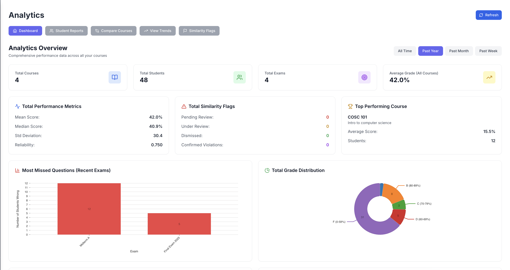
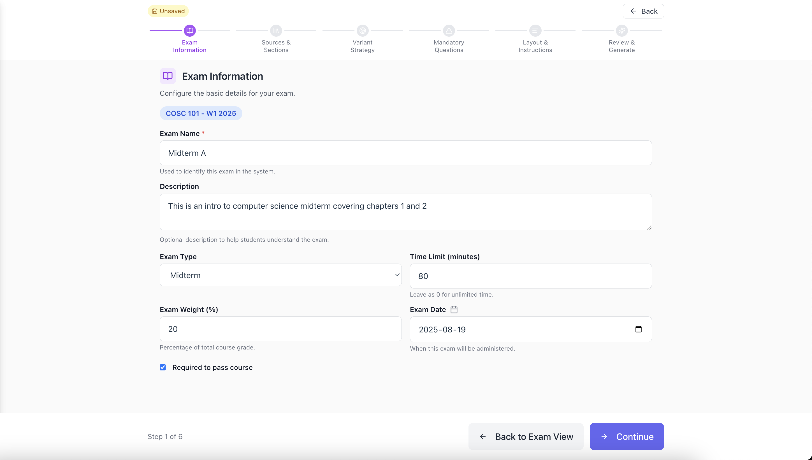
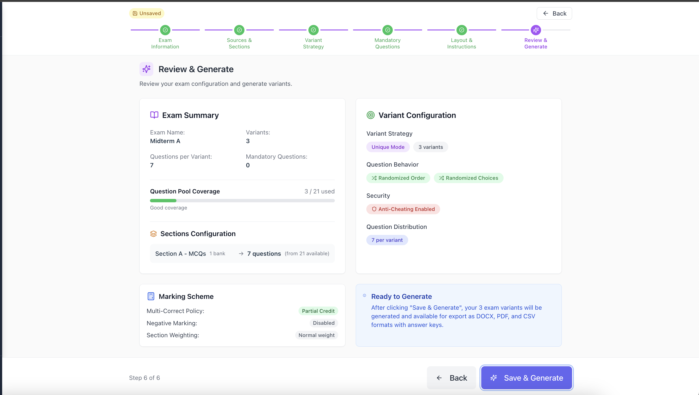
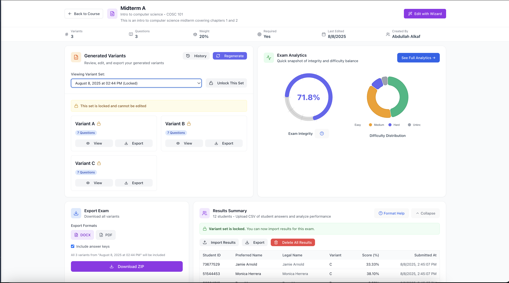
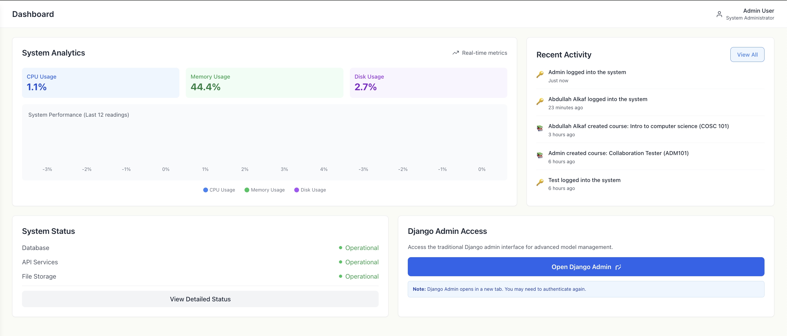
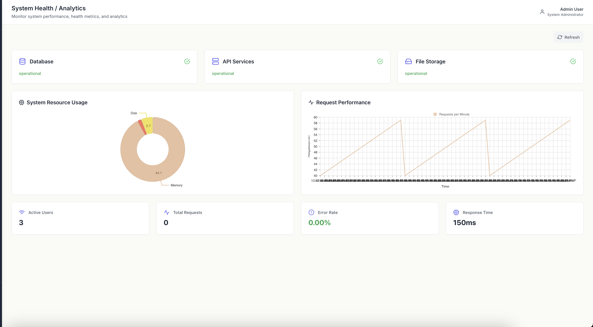

# ExamVault - Comprehensive Exam Management System

[](https://www.djangoproject.com/)
[](https://reactjs.org/)
[](https://www.typescriptlang.org/)
[](https://www.docker.com/)
[](LICENSE)

## 📋 Table of Contents

- [Overview](#-overview)
- [Features](#-features)
- [Architecture](#️-architecture)
- [Quick Start](#-quick-start)
- [Installation](#-installation)
- [Usage](#-usage)
- [API Documentation](#-api-documentation)
- [Testing](#-testing)
- [Deployment](#-deployment)
- [Contributing](#-contributing)
- [License](#-license)

## 🎯 Overview

ExamVault is a modern, full-stack exam management system designed for educational institutions. Built with Django and React, it provides comprehensive tools for creating, exporting, and  analyzing examinations with advanced anti-cheating capabilities.


*Analytics dashboard with performance charts and exam integrity analysis*


### Key Highlights
- **Rapid Variant Generation and Exam Creation**: Create a course, configure an exam that generates multiple fair variants based on difficulty and sections in under two minutes using our exam creation wizard
- **Results & Analytics**: Upload results from OMR machine exported CSV files, and have access to various data visualizations
- **Advanced Question Banking**: Multi-format export and intelligent categorization
- **Comprehensive Analytics**: Detailed reporting and performance insights
- **Role-Based Access**: Admin and Instructor interfaces

## ✨ Features

### 🎓 Course Management
- Create and manage courses with detailed metadata
- Instructor-course assignment and collaboration
- Student roster management and enrollment
- Course analytics and performance tracking

### 📝 Question Banking
- Question import (CSV)
- Question categorization and difficulty levels
- Bulk question operations and management
- Question preview and validation

### 📊 Exam System
- Flexible exam creation with customizable parameters
- Multiple exam variants generation
- Time limits and weight-based scoring
- Immediate analytics available regarding exam integrity

<div align="center">
  
  
</div>

*Exam creation wizard: Configuration setup (left) and variant generation summary (right)*

### 🛡️ Anti-Cheating Features
- Variant generation algorithm to minimize question position vulnerability
- Question and answer choice shuffling across variants
- Similarity analysis to detect potential collusion in uploaded results

### 📈 Analytics & Reporting
- Comprehensive student performance analytics from uploaded results
- Course-level insights and statistical trends
- Export capabilities (CSV, PDF, DOCX)
- OMR result import and analysis dashboard


*Exam management interface showing created exams and export functionality*

### 👥 User Management
- Role-based access control (Admin/Instructor)
- Email verification and password management
- User activity logging and audit trails
- Privacy compliance features (GDPR)
- Deletion and archival of PII per institutional policy

<div align="center">
  
  
</div>

*Admin interface: User management dashboard (left) and system health status (right)*

## 🏗️ Architecture

### Technology Stack

**Backend:**
- **Framework**: Django 4.2+ with Django REST Framework
- **Database**: PostgreSQL with Redis caching
- **Authentication**: JWT-based with role-based permissions
- **File Processing**: Document parsing (CSV) and multi-format export (PDF, DOCX, CSV)

**Frontend:**
- **Framework**: React 18+ with TypeScript
- **Styling**: Tailwind CSS with responsive design
- **Build Tool**: Vite for fast development
- **State Management**: React Context API

**Infrastructure:**
- **Containerization**: Docker & Docker Compose
- **Web Server**: Nginx reverse proxy
- **Development**: Hot reload and development tools

### System Architecture

```
┌─────────────────┐    ┌─────────────────┐    ┌─────────────────┐
│   Nginx Proxy   │    │  React Frontend │    │ Django Backend  │
│   (Port 80)     │◄──►│   (Port 5173)   │◄──►│   (Port 8000)   │
└─────────────────┘    └─────────────────┘    └─────────────────┘
                                │                       
                                ▼                       
                       ┌─────────────────┐    
                       │   PostgreSQL    │    
                       │   (Port 5432)   │    
                       └─────────────────┘    
```

## 🚀 Quick Start

### Prerequisites

- Docker and Docker Compose
- Node.js 18+ (for development)
- Python 3.11+ (for development)

### One-Command Setup

```bash
# Clone the repository
git clone <repository-url>
cd team-14-capstone-team-14-capstone

# Start all services
docker-compose up --build
```

Access the application at: http://localhost

## 📦 Installation

### Option 1: Docker (Recommended)

```bash
# Build and start all services
make up-build

# Or using docker-compose directly
docker-compose up --build -d
```

### Option 2: Local Development

```bash
# Backend Setup
cd app/backend
pip install -r requirements.txt
python manage.py migrate
python manage.py createsuperuser

# Frontend Setup
cd ../frontend
npm install
npm run dev
```

## 🎮 Usage

### Access Points

| Service | URL | Description |
|---------|-----|-------------|
| Main Application | http://localhost | React frontend |
| API Documentation | http://localhost/api/ | REST API endpoints |
| Admin Dashboard | http://localhost/admin-panel/ | React admin interface |
| Django Admin | http://localhost/admin/ | Django admin panel |
| PgAdmin | http://localhost:5050 | Database management |

### Default Credentials

**Admin User:**
- Email: `admin@test.com`
- Password: `admin123`


### Core Workflows

#### 1. Course Management
```
Admin/Instructor → Create Course → Add Students → Create Question Banks → Create Exams
```

#### 2. Question Banking
```
Instructor → Import Questions → Categorize → Review → Add to Bank
```

#### 3. Exam Creation & Export
```
Instructor → Start Wizard → Configure Settings → Generate Variants → Export PDF/DOCX
```

#### 4. Results Upload & Analytics
```
Instructor → Upload OMR Results → View Analytics → Export Reports → Analyze Performance
```

## 📚 API Documentation

### Authentication

All API endpoints require authentication via JWT tokens:

```bash
# Login to get token
curl -X POST http://localhost/api/auth/login/ \
  -H "Content-Type: application/json" \
  -d '{"email": "user@example.com", "password": "password"}'
```

### Core Endpoints

| Endpoint | Method | Description |
|----------|--------|-------------|
| `/api/auth/` | POST | Authentication endpoints |
| `/api/courses/` | GET/POST | Course management |
| `/api/questions/` | GET/POST | Question banking |
| `/api/exams/` | GET/POST | Exam management |
| `/api/results/` | GET/POST | Exam results |
| `/api/analytics/` | GET | Analytics data |

### Example API Usage

```bash
# Get all courses
curl -H "Authorization: Bearer <token>" \
  http://localhost/api/courses/

# Create a new question
curl -X POST -H "Authorization: Bearer <token>" \
  -H "Content-Type: application/json" \
  -d '{"question_text": "What is...", "type": "multiple_choice"}' \
  http://localhost/api/questions/
```

## 🧪 Testing

### Quick Start

```bash
# Run all tests
make test-all

# Run with coverage
make coverage-all
```

### Documentation

- **[User Workflows Guide](docs/USER_WORKFLOWS.md)** - Step-by-step user workflows for admins and instructors
- **[API Documentation](docs/API_DOCUMENTATION.md)** - Complete API reference and endpoint documentation
- **[Testing Guide](docs/TESTING_GUIDE.md)** - Comprehensive testing procedures and commands
- **[Troubleshooting Guide](docs/TROUBLESHOOTING_GUIDE.md)** - Common issues and solutions
- **[Exam Creation Guide](docs/EXAM_CREATION_GUIDE.md)** - Complete exam creation workflow and algorithm details

### Test Coverage

- **Backend**: Comprehensive Django test suite
- **Frontend**: Vitest with React Testing Library
- **Integration**: End-to-end testing scenarios

## 🚀 Deployment

### Production Setup

1. **Environment Configuration**
```bash
# Copy and configure environment variables
cp .env.example .env
# Edit .env with production values
```

2. **Database Migration**
```bash
docker-compose exec backend python manage.py migrate
```

3. **Static Files**
```bash
docker-compose exec backend python manage.py collectstatic
```

4. **Start Services**
```bash
docker-compose up -d
```

### Environment Variables

```env
Check .env.example file
```

## 🛠️ Development

### Development Commands

```bash
# Build containers
make build

# Start development environment
make up

# Run migrations
make migrate

# View logs
make logs

# Access shells
make shell-backend
make shell-frontend
make shell-db
```

### Code Quality

```bash
# Backend formatting
make format-backend

# Frontend linting
make lint-frontend

# Run all quality checks
make quality-check
```

## 📁 Project Structure

```
team-14-capstone-team-14-capstone/
├── app/                          # Main application
│   ├── backend/                  # Django backend
│   │   ├── courses/             # Course management
│   │   ├── exams/               # Exam system
│   │   ├── questions/           # Question banking
│   │   ├── users/               # User management
│   │   ├── results/             # Exam results
│   │   ├── analytics/           # Analytics & reporting
│   │   └── tests/               # Backend tests
│   └── frontend/                # React frontend
│       ├── src/
│       │   ├── pages/           # Page components
│       │   ├── components/      # Reusable components
│       │   ├── api/             # API integration
│       │   └── types/           # TypeScript definitions
│       └── public/              # Static assets
├── docs/                        # Documentation
├── nginx/                       # Web server configuration
├── scripts/                     # Utility scripts
└── docker-compose.yml           # Container orchestration
```

## 🤝 Contributing

### Development Workflow

1. **Fork the repository**
2. **Create a feature branch**: `git checkout -b feature/amazing-feature`
3. **Make your changes** following the coding standards
4. **Write tests** for new functionality
5. **Commit your changes**: `git commit -m 'Add amazing feature'`
6. **Push to the branch**: `git push origin feature/amazing-feature`
7. **Open a Pull Request**

### Coding Standards

- **Backend**: Follow PEP 8 and Django best practices
- **Frontend**: Use ESLint and Prettier configurations
- **Testing**: Maintain >80% test coverage
- **Documentation**: Update docs for new features

## 📄 License

This project is licensed under the MIT License - see the [LICENSE](LICENSE) file for details.

## 🙏 Acknowledgments

- Django and React communities
- Educational technology research
- Open source contributors

## 📞 Support

For support and questions:
- Create an issue in the repository
- Check the [documentation](docs/)
- Review the [troubleshooting guide](docs/TROUBLESHOOTING_GUIDE.md)

---

**ExamVault** - Empowering education through intelligent exam management.

[](https://github.com/your-org/examvault)
